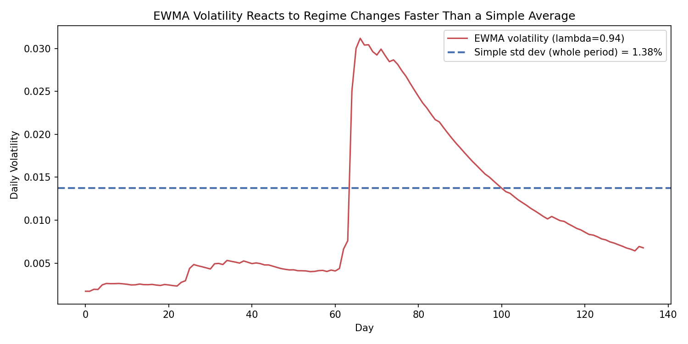

# EWMA Volatility & VaR Calculator

A Python implementation of EWMA (Exponentially Weighted Moving Average) volatility
estimation, in the RiskMetrics style, used to compute a volatility-adjusted VaR.

## Why EWMA?

A simple standard deviation over a fixed window (e.g. 250 days) treats every day
equally, so it reacts slowly when market volatility suddenly spikes (or calms down) —
a shock from yesterday is diluted by 249 calmer days.

EWMA instead weights recent observations exponentially more than older ones, so the
volatility estimate reacts quickly to regime changes. It's the methodology behind
JP Morgan's original RiskMetrics framework, and is a standard tool in market risk
management.

## The Formula

```
σ²_t = λ · σ²_(t-1) + (1 - λ) · r²_(t-1)
```

- `σ²_t`: today's estimated variance
- `r_(t-1)`: yesterday's return
- `λ` (lambda): decay factor controlling how much weight recent data gets
  (RiskMetrics standard: **0.94** for daily data)

Today's volatility estimate is built recursively from yesterday's estimate plus
yesterday's realized squared return — so a single large move immediately shows up
in the estimate, instead of being averaged away over a long window.

## Files

| File | Description |
|---|---|
| `ewma_calculator.py` | Core EWMA functions (`ewma_volatility`, `ewma_var`) — demo runs on synthetic data |
| `ewma_calculator_data.py` | Loads real data by ticker (via yfinance) or CSV, then compares simple vs. EWMA VaR |

## Usage

```bash
pip install numpy pandas yfinance matplotlib

# Run the core module on synthetic demo data (calm period + volatility shock)
python ewma_calculator.py

# Run on real market data
python ewma_calculator_data.py --ticker AAPL
python ewma_calculator_data.py --ticker BTC-USD --lam 0.97 --confidence 0.99
python ewma_calculator_data.py --csv prices.csv --price-col Close
```

Use the functions directly with your own return series:

```python
from ewma_calculator import ewma_volatility, ewma_var

ewma_volatility(returns, lam=0.94)
ewma_var(returns, confidence=0.95, portfolio_value=1_000_000, lam=0.94)
```

Note: following RiskMetrics convention, `ewma_var` assumes a zero mean return —
appropriate for short-horizon (1-day) risk, where the estimated mean return is
statistically noisy relative to volatility.

## Sample Output

The demo script simulates 60 calm days, a 15-day volatility shock, then 60 calm days
again, to show how EWMA tracks regime changes while a simple equal-weighted standard
deviation stays one fixed number:

```
Simple std dev (135 days, equal weight): 1.3756%
EWMA volatility (recent-weighted, λ=0.94): 0.6604%

Confidence 90% | Simple VaR: 17,630.25 | EWMA VaR: 8,463.48
Confidence 95% | Simple VaR: 22,627.96 | EWMA VaR: 10,862.65
Confidence 99% | Simple VaR: 32,001.59 | EWMA VaR: 15,362.51
```



The chart shows the point: EWMA jumps almost immediately when the shock hits (around
day 62), then decays back toward the calm level as the crisis fades. The simple
standard deviation is one fixed number that is too low during the shock and too high
afterward. By the last day the crisis is over, so EWMA correctly reports low current
volatility (0.66%) while the simple average (1.38%) is still inflated by the old shock.

### Real data example

```
$ python ewma_calculator_data.py --ticker AAPL

Data range: 2025-09-26 ~ 2026-09-25 (251 trading days)
Simple std dev: 1.5412% | EWMA volatility (λ=0.94): 1.4160%

1-Day VaR at 95% confidence, $1,000,000 portfolio
  Simple VaR : 25,350.78
  EWMA VaR   : 23,292.35
```
